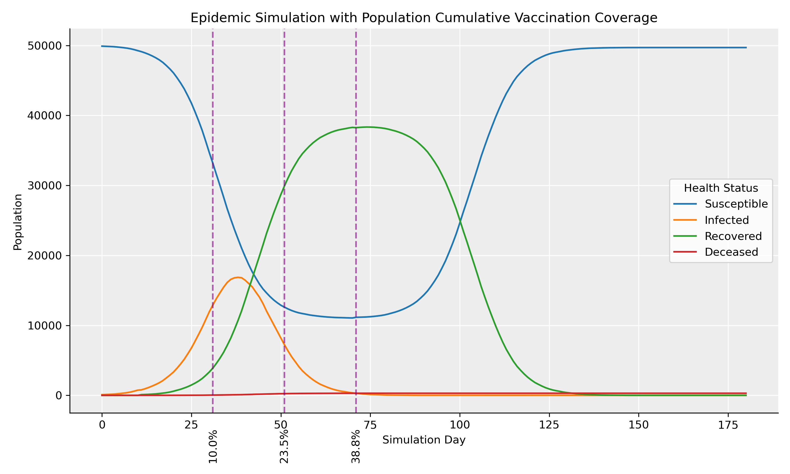

# Epidemic Simulation in C++ 🦠

## Technologies 💻

**Language:** C++

**Libraries:** C++ Standard Library

**Visualisation:** Python, Pandas, Matplotlib

## Overview ⚡

This project implements a stochastic agent-based epidemic simulator in C++ to model the spread and progression of infectious disease through a population.

Each member of the population is represented as an individual `Person` object with attributes including age, susceptibility, vaccination status, health status, and infection history.

Disease transmission is simulated through a configurable number of random daily interactions between individuals. Monte Carlo sampling is used to determine transmission and mortality outcomes, allowing identical simulation configurations to produce different epidemic trajectories.

The simulation supports vaccination campaigns, temporary post-infection immunity, reinfection, and configurable disease characteristics.

Simulation statistics are recorded for each day and exported to CSV for visualisation and analysis using Python.

## Features 🧬

* Agent-based population modelling
* Randomised population generation
* Individual age and susceptibility attributes
* Susceptible, infected, recovered, and deceased health states
* Configurable disease transmission probability
* Configurable infectious duration
* Configurable mortality rate
* Configurable post-infection immunity duration
* Temporary immunity and reinfection
* Random daily contact simulation
* Individual infection and recovery duration tracking
* Stochastic transmission using Monte Carlo sampling
* Optional vaccine integration
* Configurable vaccine infection reduction
* Configurable vaccine mortality reduction
* Disease-specific vaccine targeting
* Gradual vaccination campaigns
* Cumulative vaccination tracking
* Daily simulation history
* CSV result export
* Epidemic curve visualisation using Pandas and Matplotlib

## Simulation Model 📈

For each contact between an infected and susceptible individual, base transmission probability is calculated as:

`Individual Susceptibility × Disease Transmission Probability`

A random probability sample determines whether transmission occurs.

If the susceptible individual is vaccinated and the configured vaccine targets the simulated disease, the effective transmission probability is reduced according to the vaccine's infection reduction.

New infections are applied after the current simulation day has completed, preventing newly infected individuals from transmitting the disease until the following day.

Once an individual's infectious duration has elapsed, a mortality probability determines whether they recover or become deceased. Vaccination can also reduce mortality probability for vaccinated individuals.

Recovered individuals remain immune for the configured disease immunity duration. Once this period expires, they return to the susceptible state and can become infected again.

## Vaccination 💉

Vaccination can be introduced at any point during a simulation.

Vaccination campaigns target a configurable proportion of the currently unvaccinated population, allowing gradual vaccine rollouts to be modelled across an ongoing epidemic.

Vaccination status is independent of health status, meaning vaccinated individuals may still be susceptible, infected, recovered, or deceased.

## Simulation Visualisation 📊

Daily population statistics are stored during the simulation and exported to:

`results/simulation.csv`

The Python visualisation pipeline reads this data using Pandas and generates an epidemic curve showing the progression of susceptible, infected, recovered, and deceased populations over time.

Vaccination events are automatically detected from the exported simulation data and displayed as vertical markers with cumulative vaccination coverage.



## Example Output 🔬

```text
---------------------
Day: 178
Susceptible: 49701
Infected: 0
Recovered: 0
Deceased: 299
Vaccinated: 19400
---------------------
Day: 179
Susceptible: 49701
Infected: 0
Recovered: 0
Deceased: 299
Vaccinated: 19400
---------------------
Day: 180
Susceptible: 49701
Infected: 0
Recovered: 0
Deceased: 299
Vaccinated: 19400
---------------------
```
## Running the Simulation ▶️

Compile the C++ simulator using C++17:

```bash
c++ -std=c++17 -Iinclude src/*.cpp main.cpp -o epidemic_simulator
```

Run the simulation:

```bash
./epidemic_simulator
```

The simulation results are exported to:

```text
results/simulation.csv
```

To generate the epidemic visualisation:

```bash
cd visualisations
python plot.py
```

The generated graph is saved as:

```text
visualisations/epidemic_visualisation.png
```

Because the simulation is stochastic, repeated runs using identical population, disease, vaccine, and intervention parameters may produce different epidemic outcomes.

## Project Structure 📁

```text
epidemic-simulator/
├── include/
│   ├── Disease.h
│   ├── Person.h
│   ├── Population.h
│   ├── Simulation.h
│   └── Vaccine.h
│
├── src/
│   ├── Disease.cpp
│   ├── Person.cpp
│   ├── Population.cpp
│   ├── Simulation.cpp
│   └── Vaccine.cpp
│
├── results/
│   └── simulation.csv
│
├── visualisations/
│   ├── plot.py
│   └── epidemic_visualisation.png
│
├── main.cpp
└── README.md
```

## Disclaimer

This project is intended for educational and simulation purposes. The model simplifies real-world epidemiological processes and should not be used for medical or epidemiological prediction.